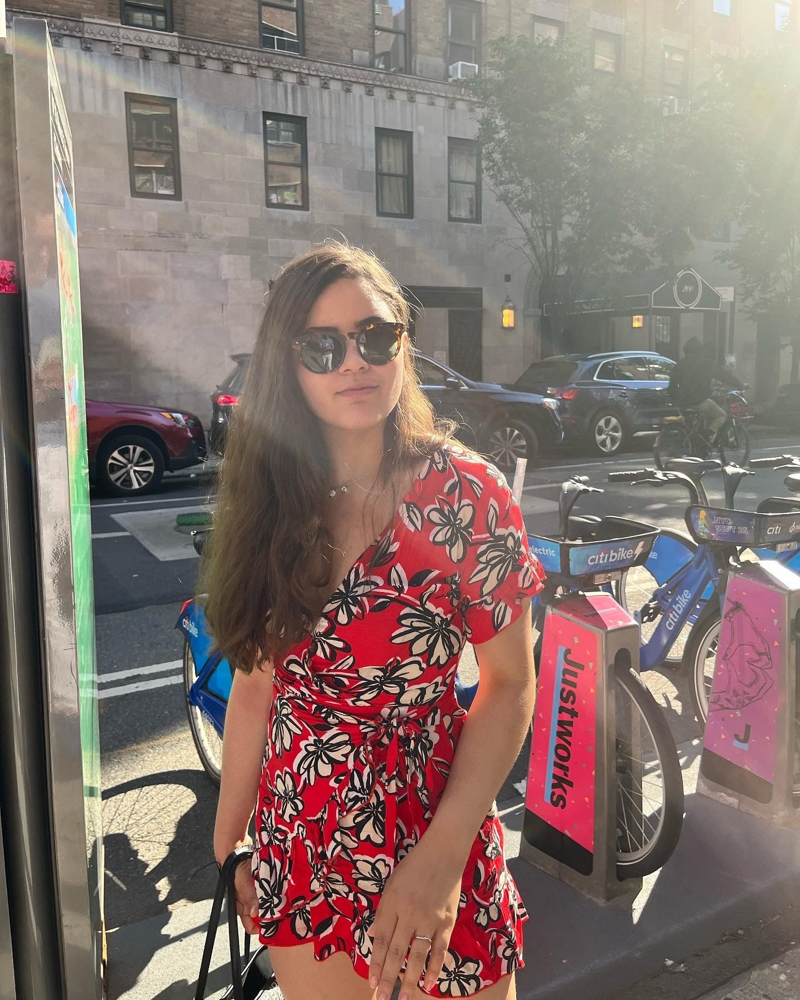

```{r, include = FALSE}

knitr::opts_chunk$set(echo = FALSE)
```

```{css}
.figure {
  float: right;
  padding: 5px;
  max-width:30%;
}
```

::: floating
```{r fig.cap = "NYC 2022"}

```

I'm currently a doctoral candidate at Drexel University's [Dornsife School of Public Health](https://drexel.edu/dornsife/) in Philadelphia. I am working under the advisement of Dr. Jane Clougherty on determining pharmaceutical treatment efficacy modification by Sscial and Environmental exposures. Previously I received an MPH in [Environmental Health Sciences](https://www.publichealth.columbia.edu/academics/departments/environmental-health-sciences-ehs) from Mailman School of Public Health and a Bachelors of Science from the [City College of New York](https://www.ccny.cuny.edu/)

My research interests are in epidemiological and biostatistical methods as well as asthma disparities. I first developed these interests as a fellow in the [Puerto Rico IPE Service Learning Fellowship](http://https://www.publichealth.columbia.edu/research/office-diversity-culture-and-inclusion/puerto-rico-ipe-service-learning-trip-0), where I got to work inter-professionally with a multidisciplinary team and develop a community-based participatory and service learning research project in San Juan, Puerto Rico.

I am a huge foodie, I visit NYC (where I am from) as often as my PhD training allows, and when I am not gardening, you can find me cuddling with my Bichon-Frise puppy, Lilu. I am also an amateur baker, an avid fiction reader and an R-expert-wannabe.

### Interests

-   Epidemiological and biostatistical methods
-   Causal inference
-   Asthma disparities
-   Clinical trials
:::

```{js}
var myCaptions = document.getElementsByClassName("caption");
for (var i = 0; i < myCaptions.length; i++) {
  myCaptions[i].innerHTML = myCaptions[i].innerHTML.slice(11);
}
```
